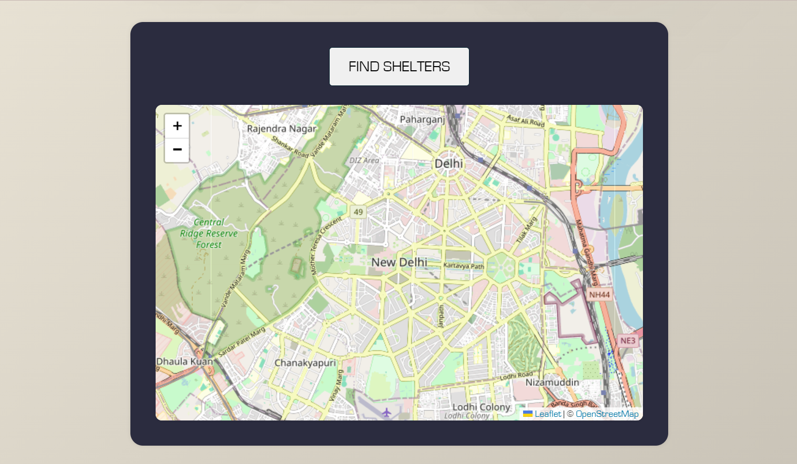
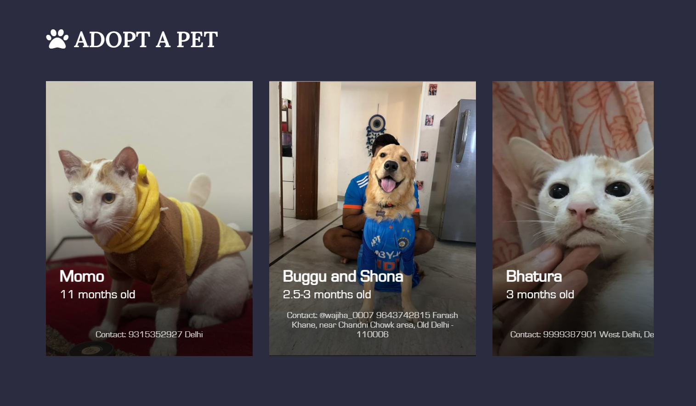

# Smart Rescue App

The Smart Rescue App is a tool designed to help locate and connect with nearby animal shelters during emergencies. With a simple tap on the Rescue button, the app fetches the user's GPS location and returns a list of nearby shelters, enabling faster response for animal rescues.

## Features
- Real-time GPS location detection
- Nearby animal shelters listing (sorted by distance)
- Quick contact options (call)
- Google Maps directions redirection

- Adoption list
- List of pets along with their details and contact info

## Tech Stack
- Frontend: React (with Leaflet maps)
- Backend: Node.js + Express
- Database: MongoDB
- APIs: Google Maps (directions), WhatsApp/Email integrations
- Frameworks/libraries: Leaflet, GeoJSON, ColorThief

## App Preview

